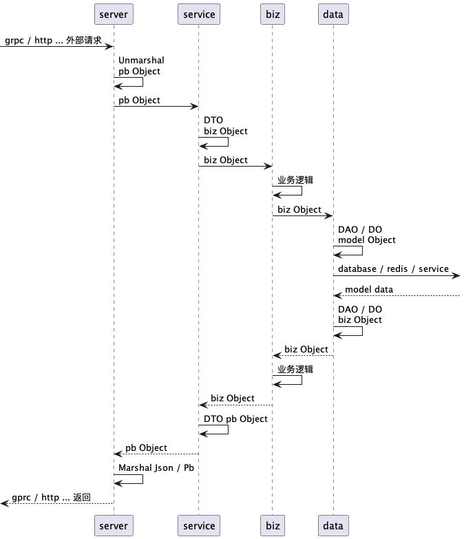
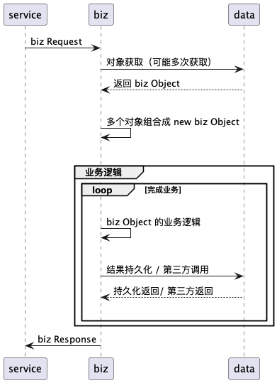
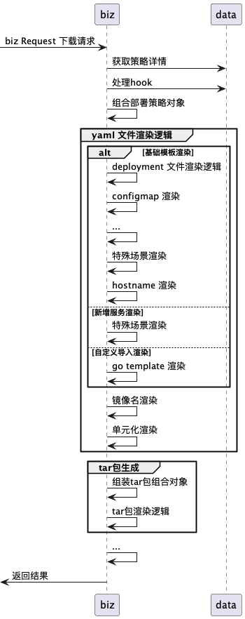
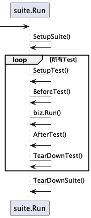

# 单元测试

## 单元测试目的及目标

* 提高代码质量，通过代码覆盖率体现代码测试情况及案例覆盖范围
* 防止新功能影响原有功能的运行结果，减轻迭代过程的难度
* 故障排查能够快速复现和定位问题
* 测试驱动开发，迫使开发过程思考结构化和简化，实现高内聚低偶合
* 提高代码的可读性，所有函数的功能单一化
* 降低重构难度，所有优化和代码结构的重构能依据单元测试实现功能校验

### 覆盖范围

主要覆盖业务逻辑，要求业务逻辑代码覆盖率达到 75% 以上

## kratos 的分层与单元测试范围

<figure><figcaption><p>kartos 层级</p></figcaption></figure>

<figure><figcaption><p>biz 层业务内容</p></figcaption></figure>

参考上图的时序图，biz 层的代码实现内容一般分为以下内容：

1. 数据读取
2. 业务数据组合
3. 执行业务逻辑
4. 数据存储或第三方事务组合

单元测试主要覆盖 _<mark style="color:red;">**执行业务逻辑**</mark>_ 部分，需要较多的案例覆盖；数据读取、组合、事务组合的内容只需要覆盖率满足即可

## 设计思路

TDD 的设计模式从实现上设计及成本要求比较高

需求分析阶段，明确整个需求的业务流程、**所有**预期场景、结果返回、错误处理；

概要设计阶段，具体描述业务流程的每个步骤，步骤预期的业务、执行和返回内容；

详细设计阶段，要求提供具体的 interface 实现及对应的fake代码业务流程；

开发阶段，优先将 fake 业务流程转换成单元测试代码，并填充需求分析和概要设计中的所有场景和结果判断，在不断的执行错误中填充实际的业务代码内容完成开发。

考虑实际的设计难度和时间成本，目前不计划采用TDD形式进行设计和开发，但需要在设计阶段从单元测试可行性考虑后续如何编写，要求单元测试内容功能单一、对函数、对象方法实现高内聚低耦合

### 业务例子

部署策略提供tar包下载功能，整个业务链路大致如下：

<figure><figcaption><p>tar 包生成步骤</p></figcaption></figure>

tar包下载的流程中，包括部署策略获取、上游数据组装、yaml文件渲染、tar包其他内容获取、tar包文件结构封装和生成等多个步骤。其中针对yaml文件渲染动作，还可以拆分为 deployment 渲染、ve configmap 渲染、hostname 渲染、特殊场景渲染、镜像标签渲染等多个步骤；

#### 测试粒度

单元测试的粒度应该按照实际业务拆分逻辑，尽量细化和单一。

针对tar包生成业务，单元测试内容应该从最下层开始：&#x20;

1. deployment 及其他内容的渲染的单元测试 -- 侧重最基础的渲染逻辑和输出校验
2. 整个 biz Object 的yaml文件渲染测试及tar包结构封装和生成 -- 侧重多个渲染结果的组合校验
3. 整个 biz 接口的调用测试 -- 侧重整个接口调用结构转换和最终返回校验

#### 样例代码

单元测试的一般存在两种，一个是针对函数的测试，一个是针对对象方法的测试

* 函数单元测试

函数单元测试相对简单，一般不需要外部调用，更多是通过入参内容完成，个人认为一般是在数据结构组装或者运算比较常见

```go
package main

// 待测试函数
func Add(a, b int) int {
	return a + b
}

// 针对函数的单元测试，可以用 goland 生成
func TestAdd(t *testing.T) {
	// 定义测试案例的入参结构
	type args struct {
		a int
		b int
	}
	tests := []struct {
		name string
		args args
		want int
	}{
		// 案例内容，args为案例入参，需要根据案例造数
		// 通过 goland 生成的测试代码只需要填写入参即可
		{
			name: "normal",
			args: args{
				a: 10,
				b: 20,
			},
			want: 30,
		},
	}
		for _, tt := range tests {
		t.Run(tt.name, func(t *testing.T) {
			if got := Add(tt.args.a, tt.args.b); got != tt.want {
				t.Errorf("Add() = %v, want %v", got, tt.want)
			}
		})
	}
}
```

* 对象方法单元测试

充血模型必然需要使用的单元测试模式，针对对象提供的方法进行测试，涉及测试对象以外的对象调用时候测试案例内容复杂度和难度较大，这时候应该从解耦角度上考虑，为什么会涉及其他对象或者业务的调用，能否降低耦合

```go
package main

// Policy 部署策略事务对象
type Policy struct {
	Name        string
	ClusterName string
	Environment string
	Application string
	// 其他字段
	// ....
}

// Render 部署策略渲染方法，
func (p *Policy) Render() string {
	// 执行渲染逻辑
	// ...
	return p.Name
}

// WrongTar 生成 policy 的tar文件使用的对象
// 个人认为这种定义是错误示范，另外一个对象例子为正确示范
type WrongTar struct {
	// 引用 Policy 对象数组
	Policies []*Policy
	// 其他 tar 包内容
	Environment string
	Shell       string
	// ...
}

// Tar 例子将原本生成 tar包逻辑改为打印内容
func (t *WrongTar) Tar() error {
	for _, p := range t.Policies {
		// 执行 Policy 对象的 Render 函数 -- 与 Policy 的方法耦合，单元测试需要与 Render 渲染组合
		yaml := p.Render()
		// 假设这里处理 tar 包逻辑，例子改为内容输出
		// filename := p.Name
		// fs, _ := os.Create(filename)
		//_, _ = fs.WriteString(yaml)
		fmt.Printf("filename: %v, yaml:%v", p.Name, yaml)
	}
	return nil
}

// Tar 是另一种 tar 对象结构
type Tar struct {
	Policies []TarPolicy
	// 其他 tar 包内容
	Environment string
	Shell       string
	// ...
}

type TarPolicy struct {
	Name string
	Yaml string
}

// Tar 例子将原本生成 tar包逻辑改为打印内容
func (t *Tar) Tar() error {
	for _, p := range t.Policies {
		//filename := p.Name
		//fs, _ := os.Create(filename)
		// 不需要调用 Policy.Render，针对 Tar() 的单元测试只考虑 Tar 的业务逻辑和内容校验
		//_, _ = fs.WriteString(p.Yaml)
		fmt.Printf("filename: %v, yaml:%v", p.Name, p.Yaml)
	}
	return nil
}

func MakeTar(policies []*Policy) error {
	// WrongTar 方式
	w := WrongTar{
		Policies: policies,
		// ... 其他字段
	}
	// Tar()耦合了 Policy.Render 方式，MakeTar 入口内容简单
	_ = w.Tar()

	// Tar 方式
	// 在 MakeTar 时候将 Policy 对象调用 Render(),并转换成 TarPolicy 对象，完成Tar对象组装
	ps := make([]TarPolicy, 0, len(policies))
	for _, p := range policies {
		ps = append(ps, TarPolicy{
			Name: p.Name,
			Yaml: p.Render(),
		})
	}
	t := Tar{
		Policies: ps,
		// ... 其他字段
	}
	// Tar() 只需要 Tar 对象内容即可，不关心其中的 yaml 来源何处
	_ = t.Tar()
	return nil
}


// ----------------
// 单元测试代码
// ----------------

func TestWrongTar_Tar(t1 *testing.T) {
	// 由于是针对对象方法的单元测试，案例内容变为了对象属性字段，用于创建对象实例
	type fields struct {
		Policies    []*Policy
		Environment string
		Shell       string
	}
	tests := []struct {
		name    string
		fields  fields
		// 如果对象方法还存在其他入参，则会有 args 的对象填充到案例内容中
		// args args
		wantErr bool
	}{
		{
			name: "normal",
			fields: fields{
				// 需要根据 Policy 内容进行造数
				// 这时候还需要了解 Policy.Render 需要使用什么参数及外部调用才能完成造数
				// 但是实际上这个单元测试的目标是对 Tar() 函数的测试，不应该与其他业务逻辑关联
				Policies:    []*Policy{
					{
						Name: "app",
						Environment: "...",
						// ... 其他字段
					},
					{
						Name: "web",
						Environment: "...",
						// ... 其他字段
					},
				},
				Environment: "",
				Shell:       "",
			},
		},
	}
	for _, tt := range tests {
		t1.Run(tt.name, func(t1 *testing.T) {
			t := &WrongTar{
				Policies:    tt.fields.Policies,
				Environment: tt.fields.Environment,
				Shell:       tt.fields.Shell,
			}
			if err := t.Tar(); (err != nil) != tt.wantErr {
				t1.Errorf("Tar() error = %v, wantErr %v", err, tt.wantErr)
			}
		})
	}
}

func TestTar_Tar(t1 *testing.T) {
	type fields struct {
		Policies    []TarPolicy
		Environment string
		Shell       string
	}
	tests := []struct {
		name    string
		fields  fields
		wantErr bool
	}{
		{
			name:    "normal",
			fields:  fields{
				// 造数，只需要将固定的yaml文件填入，实际不关心yaml的来源
				// 不需要关系 Policy 造数和 Render() 具体需要哪些数据
				Policies:    []TarPolicy{
					{
						Name: "app",
						Yaml: "app-yaml",
					},
					{
						Name: "web",
						Yaml: "web-yaml",
					},
				},
				Environment: "",
				Shell:       "",
			},
			wantErr: false,
		},
	}
	for _, tt := range tests {
		t1.Run(tt.name, func(t1 *testing.T) {
			t := &Tar{
				Policies:    tt.fields.Policies,
				Environment: tt.fields.Environment,
				Shell:       tt.fields.Shell,
			}
			if err := t.Tar(); (err != nil) != tt.wantErr {
				t1.Errorf("Tar() error = %v, wantErr %v", err, tt.wantErr)
			}
		})
	}
}
```

## testify

testify 是 golang 单元测试相关的一个工具库，用来简化和规范化单元测试编写

testify 提供了几个常用的工具包：

### assert

结果判断工具包，封装了常用的判断函数，包括 Equal, NotEqual,Nil,NotNil 等非常多类型的判断，具体参考 assert 文档说明

### mock

定义了 mock 接口及实现方式，可以用来完成 stub 和 mock 内容，第三方调用或者 mock interface 使用，通过 mockery 可以一键生成 mock 文件

官方例子：

```go
package yours

import (
  "testing"
  "github.com/stretchr/testify/mock"
)

/*
  biz repo interface
*/
type PolicyRepo interface {
  GetById(int) (bool, error)
}


/*
  Mockery objects
*/

// Mockery 生成的内容，提供 mock 相关方法， 比如实现了 repo interface 
type MyMockedObject struct{
  mock.Mock
}

// Mockery 生成的内容，实现 repo interface 方法内容
func (m *MyMockedObject) GetById(number int) (bool, error) {
  args := m.Called(number)
  return args.Bool(0), args.Error(1)
}

/*
  Actual test functions
*/

// 实际编写的单元测试内容
func TestSomething(t *testing.T) {

  // 创建mock 实例
  testObj := new(MyMockedObject)

  // 设置 stub 内容，针对方法和参数进行内容返回
  testObj.On("DoSomething", 123).Return(true, nil)

  // 实际执行的单元测试内容，比如 biz Object 需要使用 repo.GetById
  b := biz.PolicyUseCase{
    repo： testObj
  }
  b.DoBiz()

  // assert that the expectations were met
  testObj.AssertExpectations(t)

}
```

更多mock 的详细用法，参考 [https://github.com/stretchr/testify/blob/master/mock/mock\_test.go](https://github.com/stretchr/testify/blob/master/mock/mock\_test.go)

### suite

测试套件，用来规范测试案例执行顺序、数据预备、清理、测试案例状态共享。

关于suite 数据预备，有以下几个函数的定义：

1. SetupSuite()  -- 整体测试开始前执行的函数
2. SetupTest()    -- 案例测试开始前执行的函数
3. BeforeTest(suiteName, testName string)  -- 指定某个案例测试开始前执行的函数
4. AfterTest(suiteName, testName string)  -- 指定某个案例测试结束后执行的函数
5. TearDownTest() -- 案例测试结束后执行的函数
6. TearDownSuite() -- 整体测试结束后执行的函数

<figure><figcaption><p>suite 执行顺序</p></figcaption></figure>

```go
// Basic imports
import (
    "testing"
    "github.com/stretchr/testify/suite"
)

// 定义 suite 套件，与业务内容进行结合
type ExampleTestSuite struct {
    suite.Suite
    VariableThatShouldStartAtFive int
}

// SetupTest 每个Test前执行的内容，这里将业务字段设置为5
func (suite *ExampleTestSuite) SetupTest() {
    suite.VariableThatShouldStartAtFive = 5
}

// 待测试的函数都必须采用 Test 开头的方法名
// 可以按照不同的案例进行测试
func (suite *ExampleTestSuite) TestExample() {
    suite.Equal(suite.VariableThatShouldStartAtFive, 5)
}

// 测试启动入口
func TestExampleTestSuite(t *testing.T) {
    suite.Run(t, new(ExampleTestSuite))
}
```

更多mock 的详细用法，参考 [https://github.com/stretchr/testify/blob/master/suite/suite\_test.go](https://github.com/stretchr/testify/blob/master/suite/suite\_test.go)
