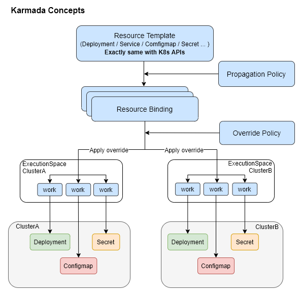

# 核心概念

架构图

<figure><figcaption></figcaption></figure>

### karmada-apiserver

跟 api-server 一直，提供相同的能力，但是 webhook 使用 karmada-webhook，并且会从 karmada-aggregated-apiserver 获取高级功能信息

### karmada-aggregated-apiserver 

api 聚合层， [Kubernetes API Aggregation Layer](https://kubernetes.io/docs/concepts/extend-kubernetes/api-extension/apiserver-aggregation/) 实现api-server 的能力拓展，karmada 主要用于 cluster.status / cluster.proxy 上面

### kube-controlloer-manager

摘选的部分 k8s 原生 controller 内容

### karmada-controller-manager

重点组件，自定义 CRD 及相关的 controller 内容，与 aggregated-apiserver 进行通信

### karmada-scheduler

重点组件
